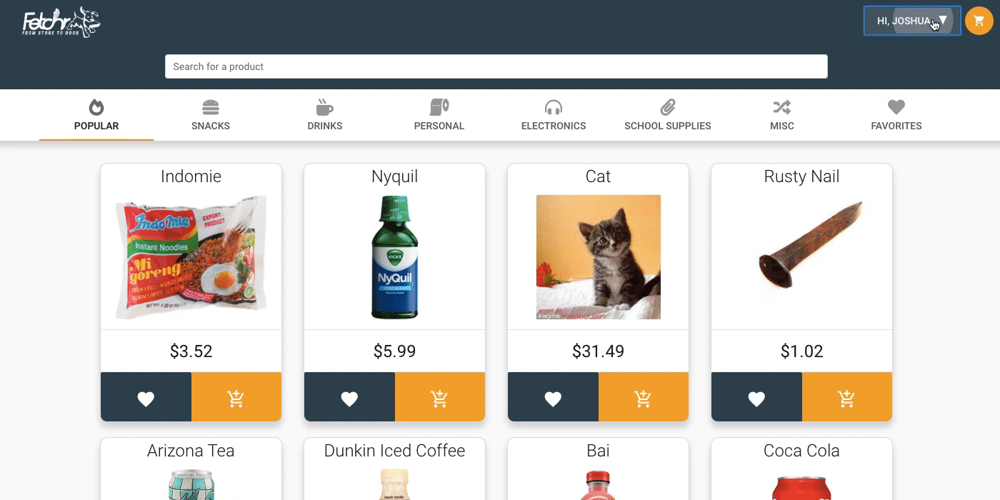
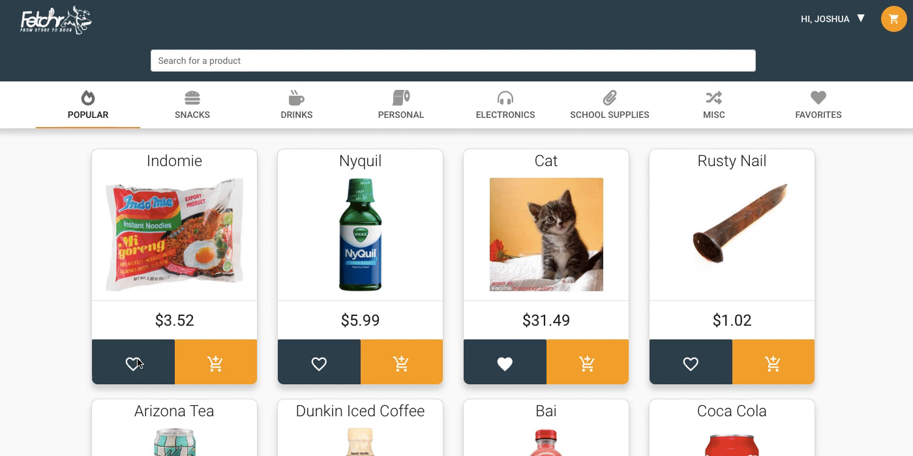
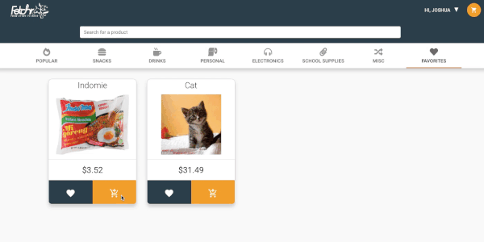
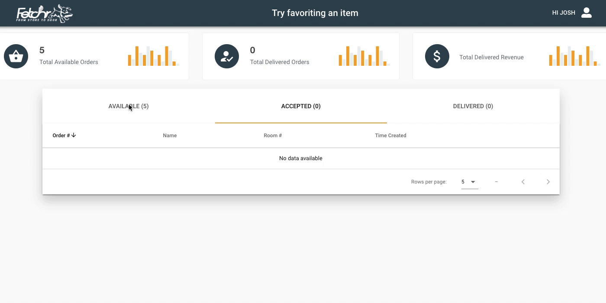
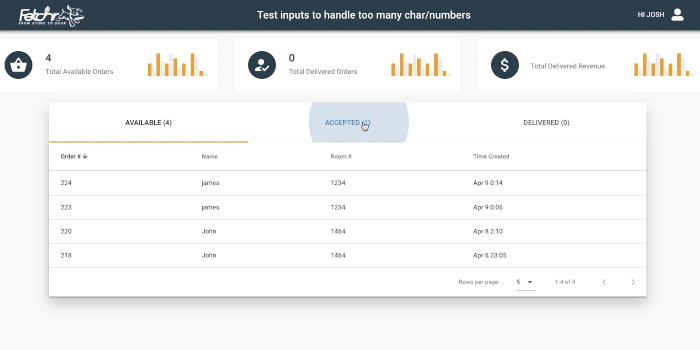
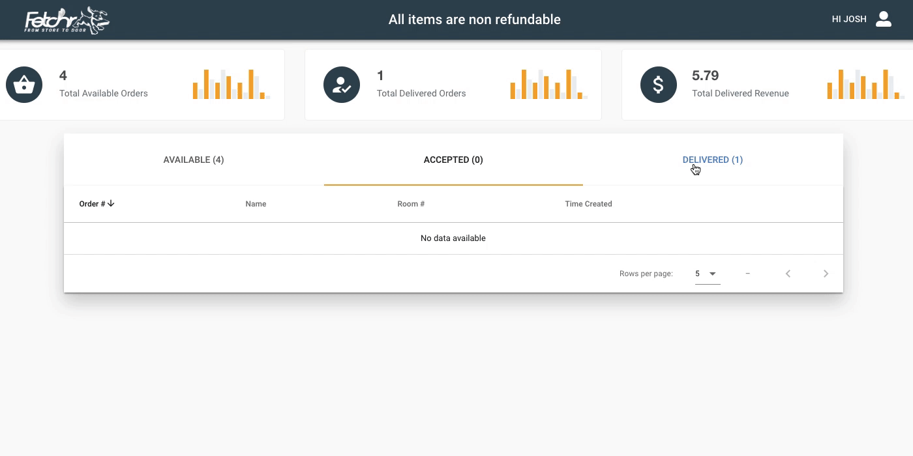

# Fetchr

## The student-run, store-to-door platform was made by students for students

_Fetchr_ is a platform that allows students to order things to be delivered to their room.

Need extra money? Sign up to be a courier! View open orders and make a quick buck on the way back from class.

**Team Name**: Devs that Deliver

**Project Name**: Fetchr

---

## Meet the team

**Team Lead**: Dave Safanyuk

**Assistant Team Lead**: Josh Johnson

**DBA**: Caleb Murray

**UI/UX**: Kesney Saurel

**QA**: James Limantara

**Communications Coordinate**: Benji Kintaudi

## Run Fetchr

Check the wiki: <https://github.com/Dsafanyuk/Fetchr/wiki>

## User Dashboard

Users can balance to their wallet

Users can add items to their favorites

Users can add items to their cart

## Courier Dashboard

Courier Accepting an Order

Courier Delivering an Order

Courier Viewing an Order

